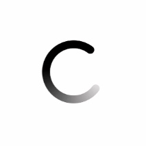
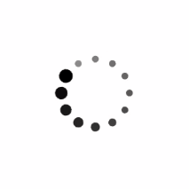
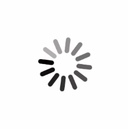

# LoadingKit
高性能 LoadingDrawable

## Preview
Style           |      Preview
------------    |   -------------
Fade            | 
FadeScale       | 
IOS             | 
IOSV2           | 

## Usage
添加 jitPack.io 仓库
``` groovy
allprojects {
	repositories {
		...
		maven { url 'https://jitpack.io' }
	}
}
```
添加依赖
``` groovy
	implementation 'com.github.cyynf:LoadingKit:1.0.0'
```
简单使用
``` kotlin
    ProgressBar progressBar = findViewById(R.id.progressBar);
    LoadingDrawable drawable = new FadeLoadingDrawable();
    drawable.setupWithProgressBar(progressBar);
```